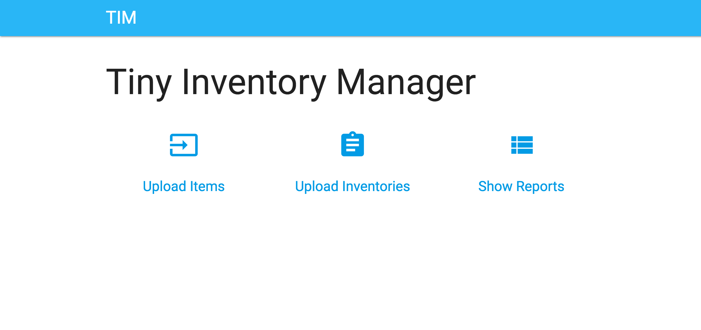

# tim
The Tiny Inventory Manager

## Requirements
- Python >= 3.6.0
- and modules in [requirements.txt](requirements.txt)

## Getting Started
```bash
git clone https://github.com/mikoim/tim.git
cd tim
pip install -r requirements.txt

# 1. Synchronize the database state
python manage.py migrate

# 2a. Run tim in development server
python manage.py runserver

# 2b. Run tim in Gunicorn
gunicorn tim.wsgi
```

## Demo


